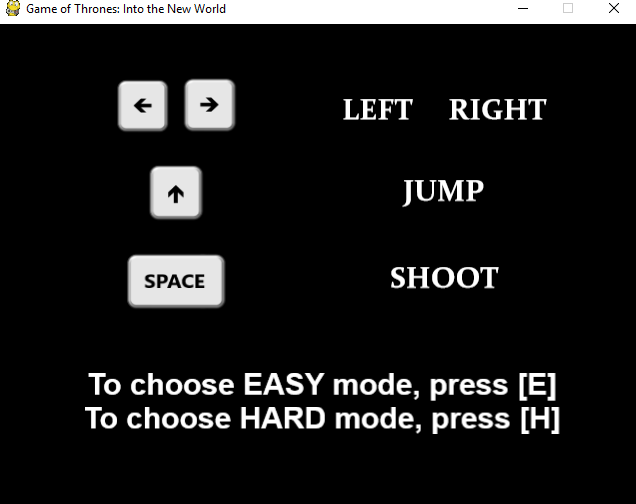
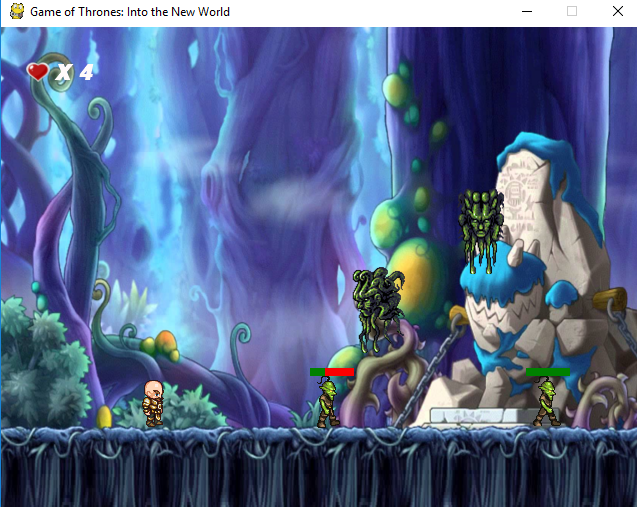
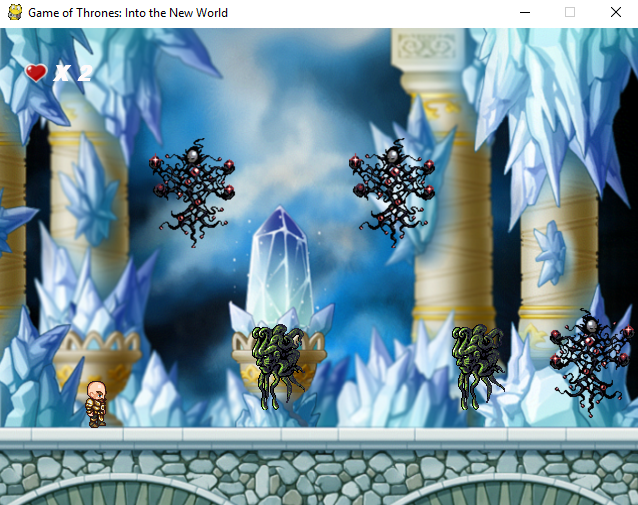
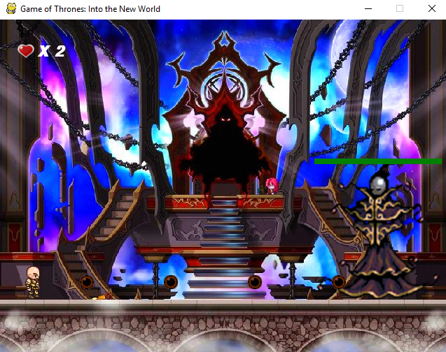
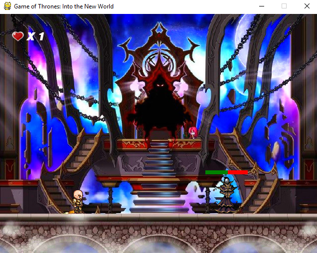
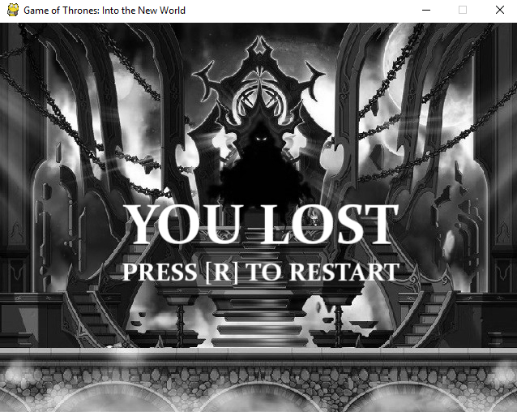
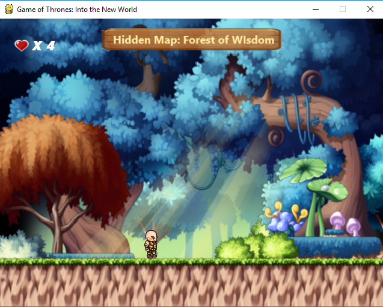

My first computing project for Python & OOP practice

Youtube Video Demo: https://youtu.be/8c68_SL-nw4

# User Guide
1. Install package `pygame`
2. run `python Game_Final.py`

Choosing the mode\

Round 1\

Round 2\

Round 3 Boss Fight 1\

Round3 Boss Fight 2\

Lost Image Display\

One of the hidden maps is activated\

